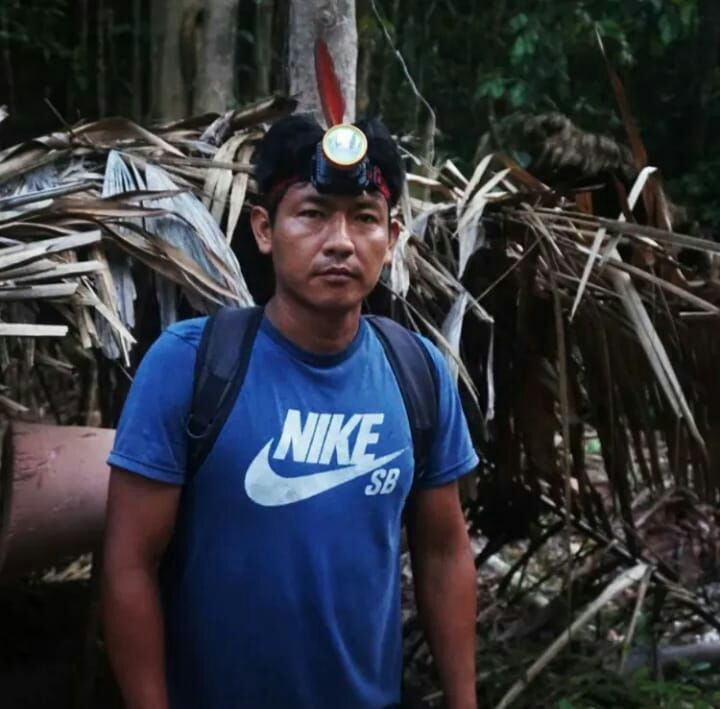
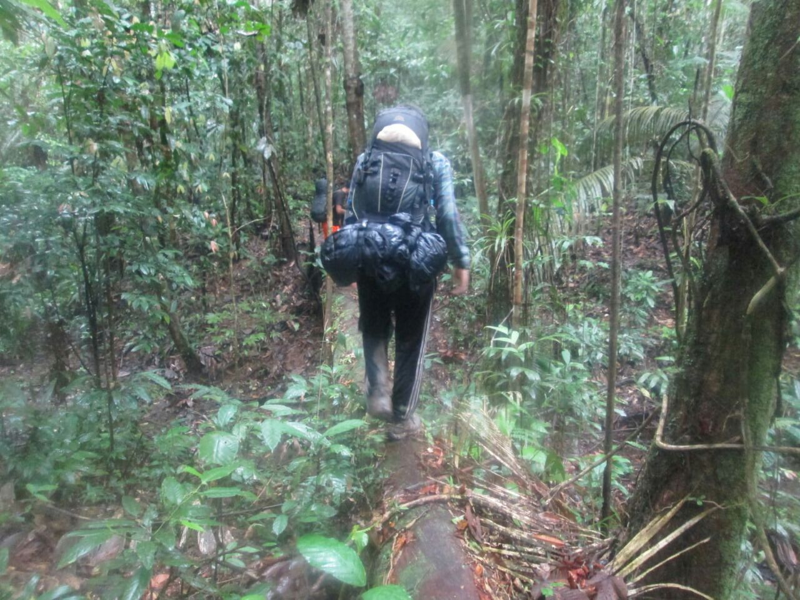
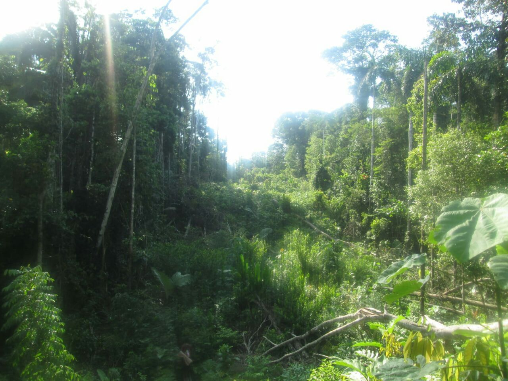
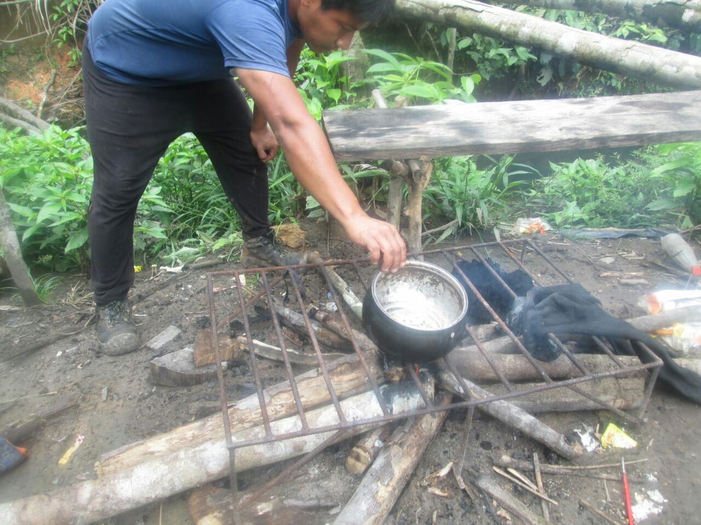
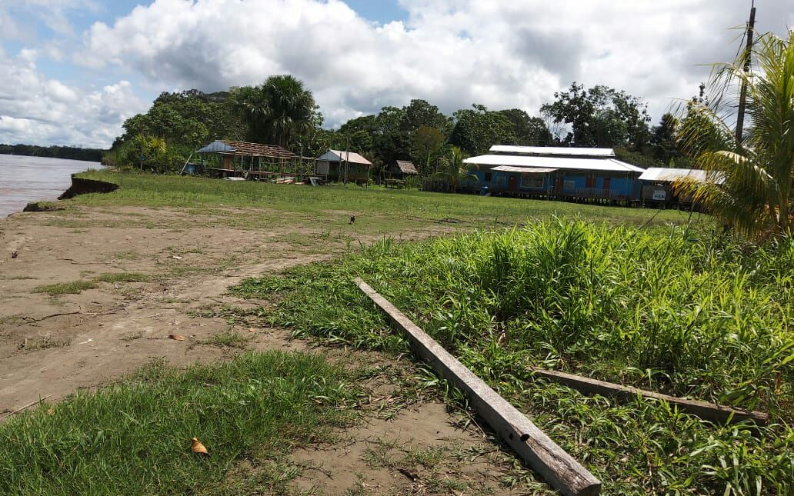
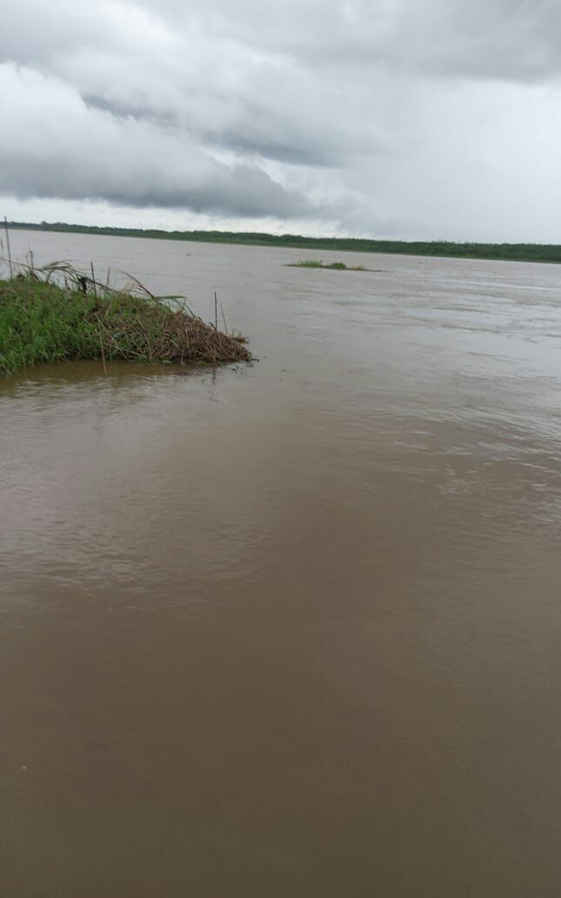
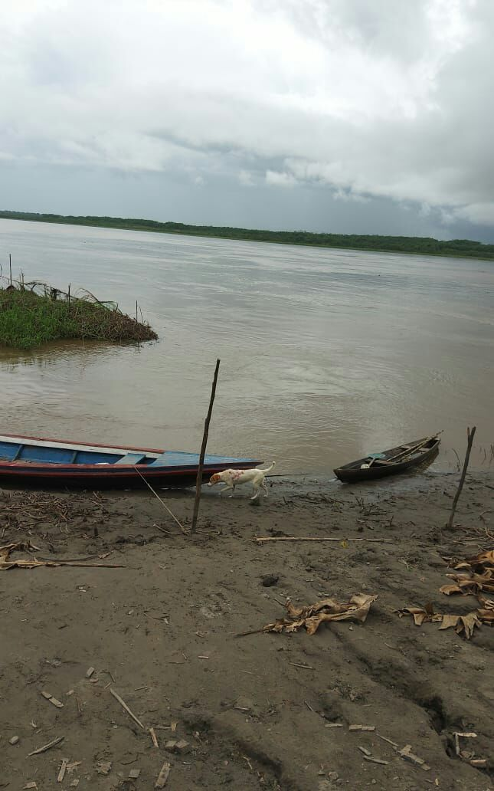

# 7 jours de découvertes (730$ par personne)

<table border="1">  
<tr><td width="35%"></td><td width="65%">Jour 1 - Visite de la communauté indigène Los Boras.</td></tr>  
<tr><td></td><td>Jour 2 - Voyage à Nauta le matin pour y  découvrir son charme.</td></tr>  
<tr><td></td><td>Jour 3 - Explorez la jungle, rencontrez différentes espèces de plantes médicinales.</td></tr>  
<tr><td></td><td>Jour 4 - Sorties nocturnes à la rencontre de différentes espèces d'animaux comme les alligators, les serpents entre autres espèces.</td></tr>  
<tr><td></td><td>Jour 5 - Pêche dans la tradition indigène en fabriquant notre propre canne à pêche.</td></tr>  
<tr><td></td><td>Jour 6 - Faire de la pirogue sur les rivières et les ruisseaux en observant différentes espèces de plantes et d'animaux.</td></tr> 
<tr><td></td><td>Jour 7 - Cérémonie nocturne d'ayahuasca rassemblant les participants avec le chaman pour effectuer un rituel de purification avec les chants du chaman et la fumée de tabac pour dire au revoir à la jungle.</td></tr> 
</table>

<b>Conditions requises pour effectuer la cérémonie:</b>

- Etre majeur
- Aucun problème cardiovasculaire
- Aucun problème psychologique
- Une semaine avant la cérémonie, arrêtez toute consommation de viande, d'aliments à forte teneur en sucre ou en matières grasses, de fritures, de toute drogue et d'alcool.
	
<b>Le prix inclu:</b>

- Hébergement
- Repas
	
# Contactez-nous

<textarea STYLE="border-style: none;" cols=80 rows=4>
        Email : maravillaamazonastourperu@gmail.com

</textarea>

# Autres photos de l'équipe et des lieux visités

<table border="1">  
<tr><td width="50%"></td><td width="50%"></td></tr>  
<tr><td width="50%"></td><td width="50%"></td></tr>  
<tr><td width="50%"></td><td width="50%"></td></tr>  
<tr><td width="50%"></td><td width="50%"></td></tr>  
<tr><td width="50%"></td><td width="50%"></td></tr>  
<tr><td width="50%"></td><td width="50%"></td></tr>  
<tr><td width="50%"></td><td width="50%"></td></tr>  
<tr><td width="50%"></td><td width="50%"></td></tr>  
<tr><td width="50%"></td><td width="50%"></td></tr>  
<tr><td width="50%"></td><td width="50%"></td></tr>  
</table>
