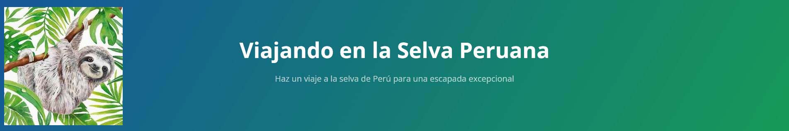

<A HREF="index-fr">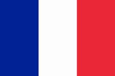</A>

# Los dias del tour ($730 por personas)

<table border="1">  
<tr><td width="35%"></td><td width="65%">Dia 1 - Visitar comunidad indigena Los Boras.</td></tr>  
<tr><td></td><td>Dia 2 - Viajar a Nauta por la mañana para conocer sus encanto de Nauta.</td></tr>  
<tr><td></td><td>Dia 3 - Explorar la selva, conocer diferentes especies de plantas medicinales.</td></tr>  
<tr><td></td><td>Dia 4 - Hacer caminata nocturnas para conocer diferentes especies de animales como caimanes, cerpientes entre otros especies.</td></tr>  
<tr><td></td><td>Dia 5 - Hacer pesca a estilo indigena elaborando nuestra propria caña de pesca.</td></tr>  
<tr><td></td><td>Dia 6 - Hacer canotaje, pasear en canoa por los rios y quebradas observando diferentes especies de plantas y animales.</td></tr> 
<tr><td></td><td>Dia 7 - Una ceremonia de ayahuasca por la noche reuniendo a los participantes junto al chaman para hacer un ritual de limpieza con sus cantos del chaman y el humo del tabaco para despedirmos de la selva.</td></tr> 
</table>

<b>Requisitos para realizar la ceremonia:</b>

- ser mayor de edad
- ningún problema cardiovascular
- ningún problema psicológico
- una semana antes de la ceremonia, suspender todo consumo de carne, alimentos con alto contenido de azúcar o grasa, frituras, todas drogas y alcohol.
	
<b>El precio incluye:</b>

- Alojamiento
- Comidas
	
	
# Contactar con nosotros

<textarea STYLE="border-style: none;" cols=80 rows=4>
        Email : maravillaamazonastourperu@gmail.com

</textarea>
	
# Otras fotos del equipo y lugares visitados

<table border="1">  
<tr><td width="50%">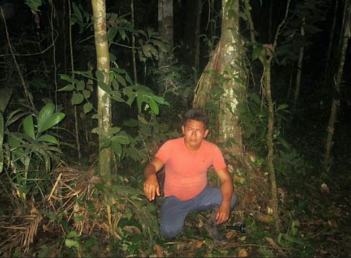</td><td width="50%">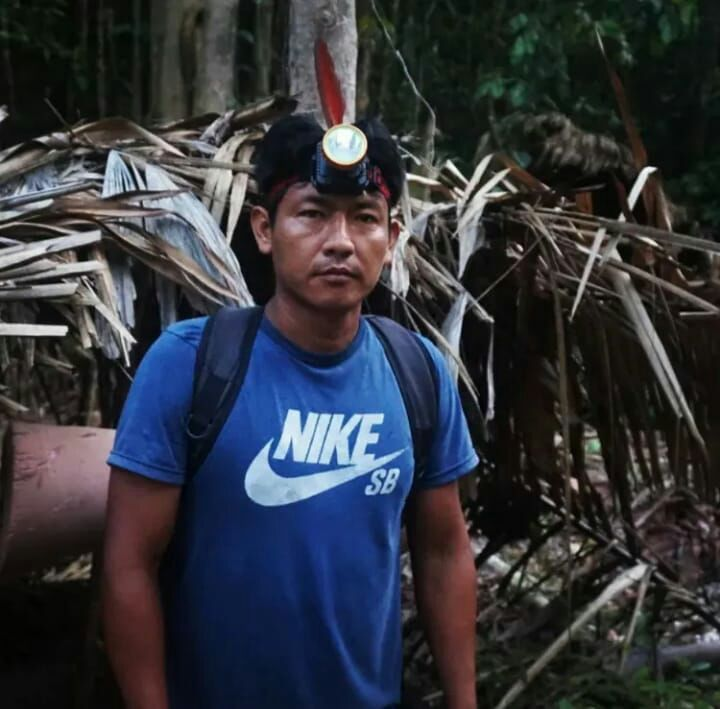</td></tr>  
<tr><td width="50%">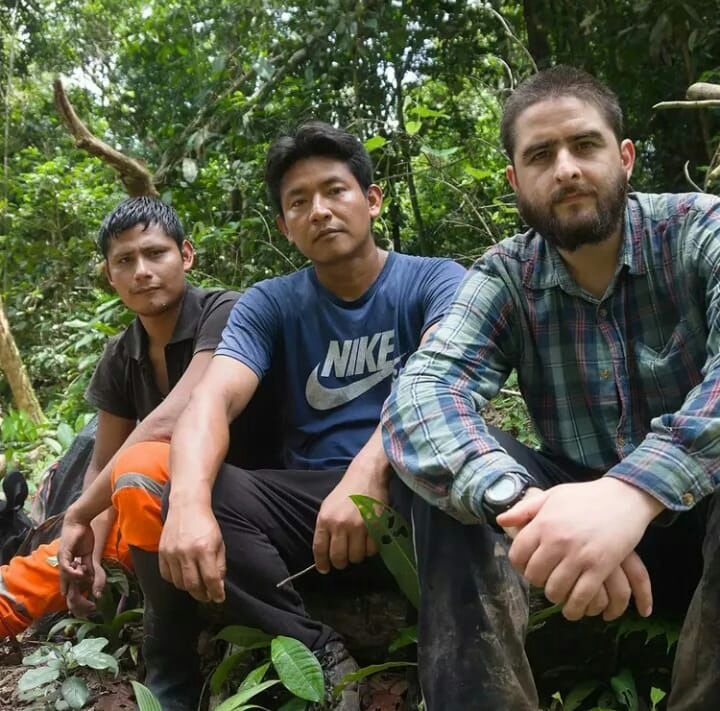</td><td width="50%">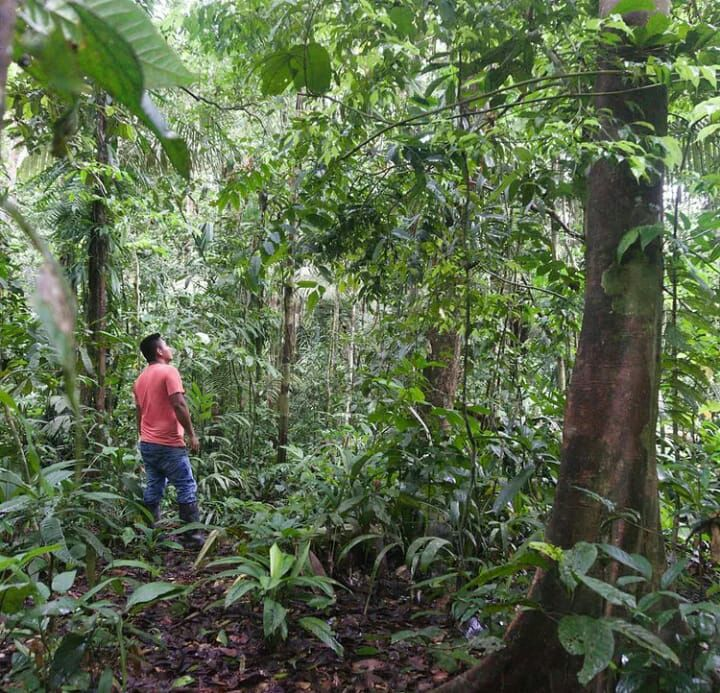</td></tr>  
<tr><td width="50%">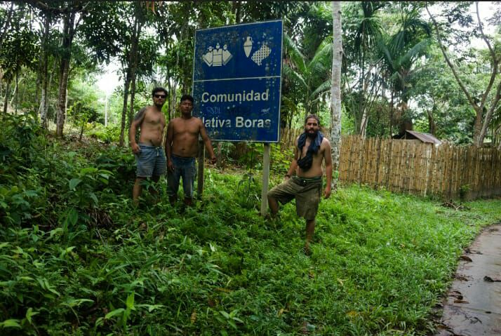</td><td width="50%">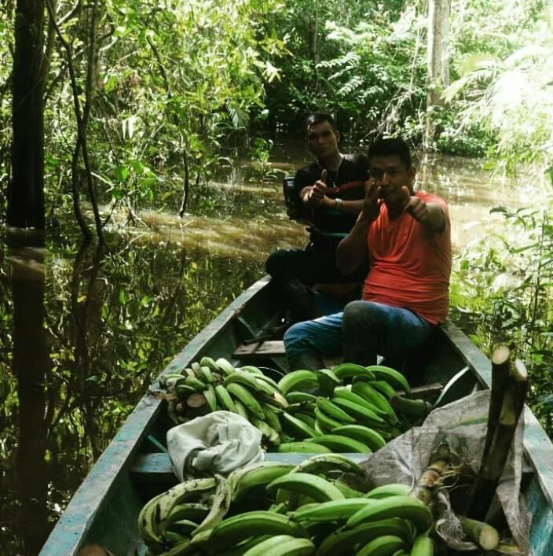</td></tr>  
<tr><td width="50%">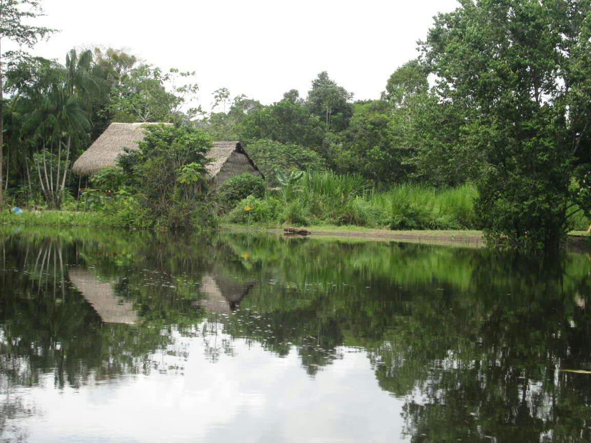</td><td width="50%">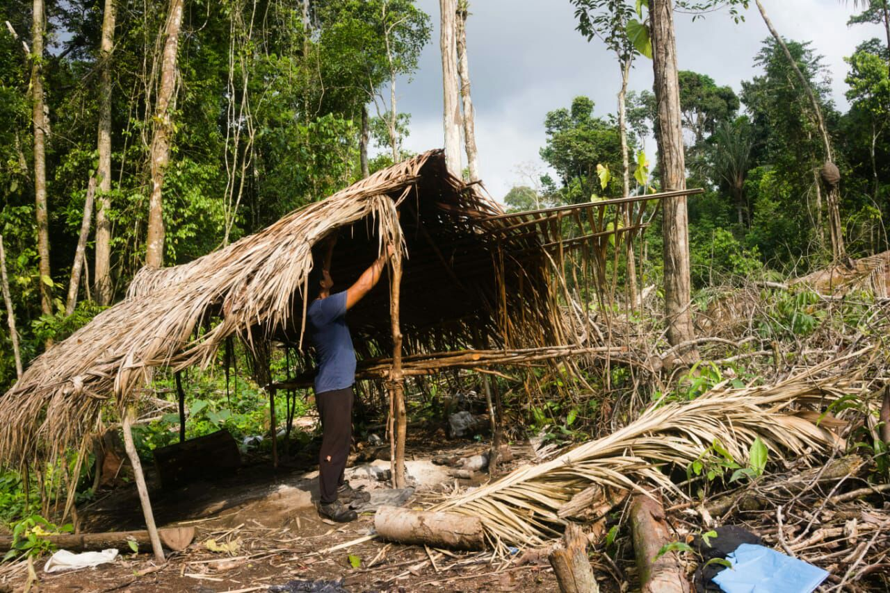</td></tr>  
<tr><td width="50%"></td><td width="50%">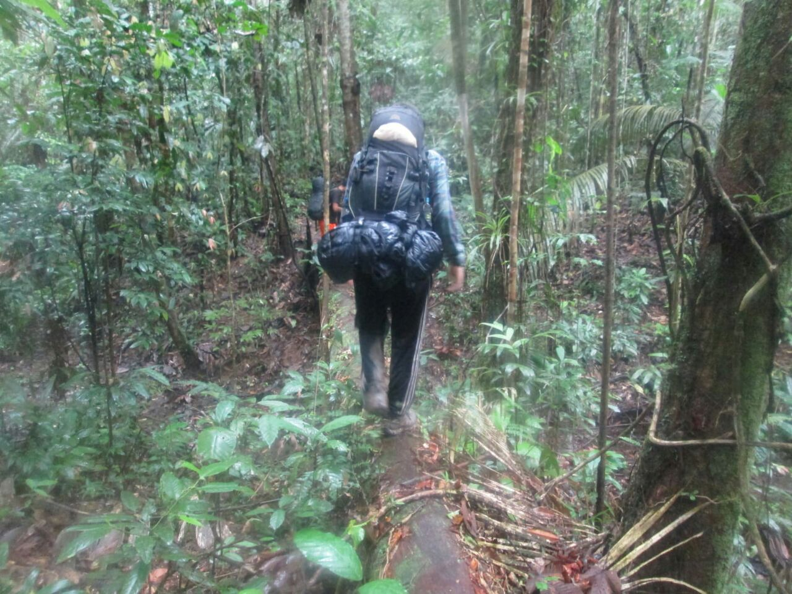</td></tr>  
<tr><td width="50%">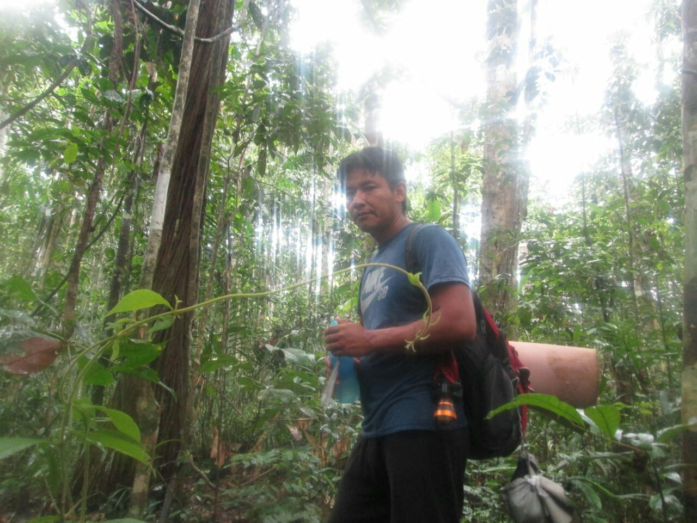</td><td width="50%">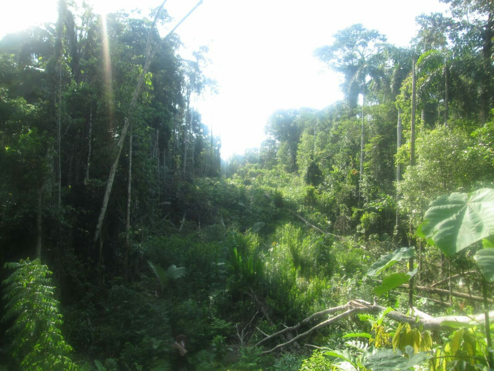</td></tr>  
<tr><td width="50%">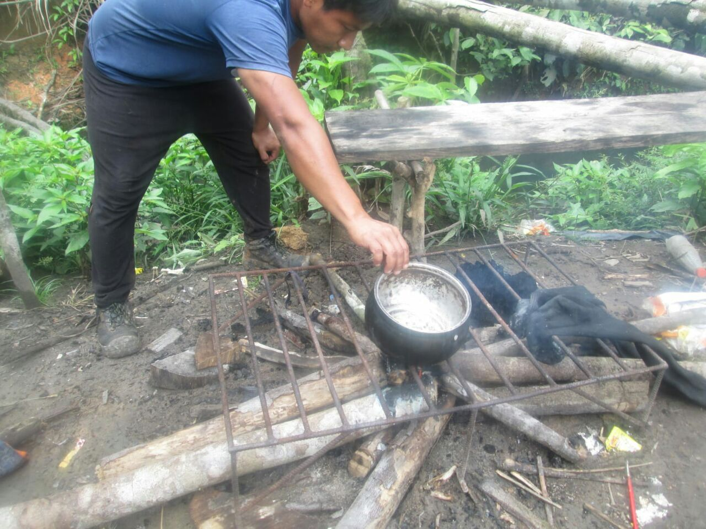</td><td width="50%">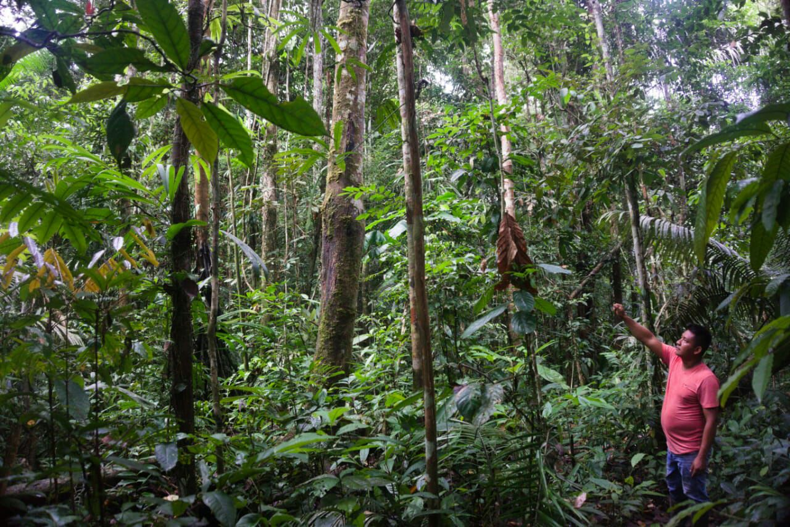</td></tr>  
<tr><td width="50%">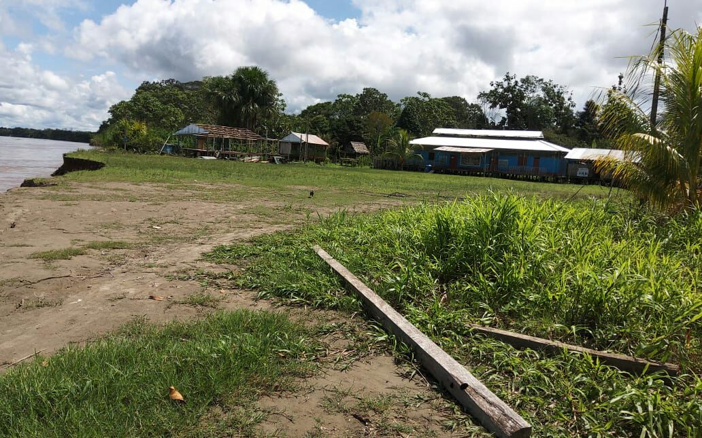</td><td width="50%"></td></tr>  
<tr><td width="50%">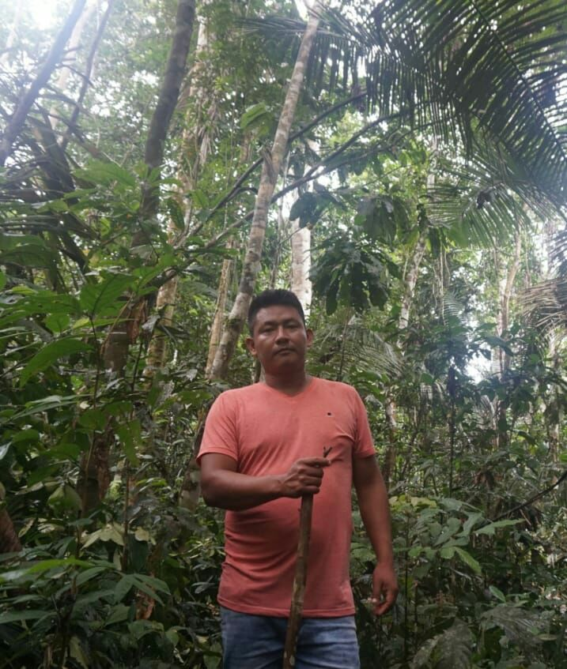</td><td width="50%"></td></tr>  
<tr><td width="50%">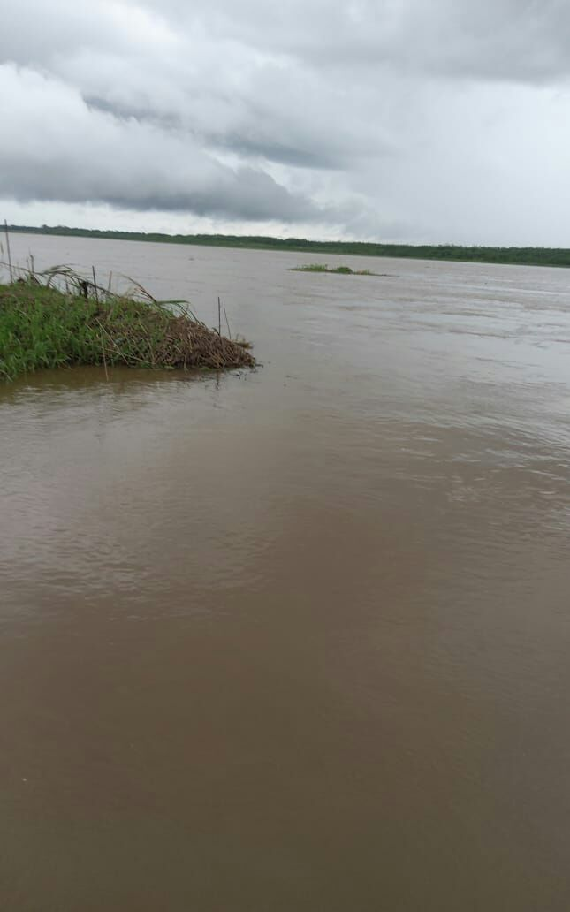</td><td width="50%">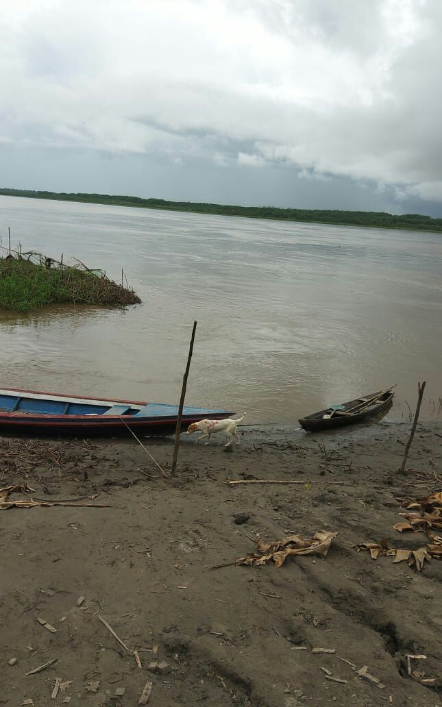</td></tr>  
</table>
